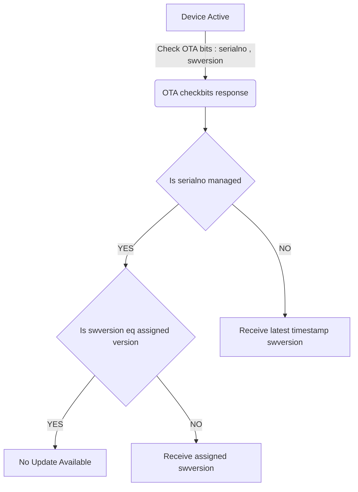

# Gizmo DM Principles

Device management is an old topic from the early days of mobile softeare.  In the modern era, we can count on fast networks.  By taking an "operator" centric approach, it should be possible to scale from 5-50K using well understood open standards for DM.

## Problem

Most solutions available for embedded systems are not using open standards from the mobile ecosystem, and the mobile ecosystem standards aren't usually supporting embedded systems.  There are several good options for pushing firmware to a specific hardware architecure.  There aren't really many "unified" open source platforms.

## Solution

Gizmo OTA DM attempts to address needs of IoT while co-existing with : edge devices, mobile devices, and use cases for industrial and consumer.

## User Stories

- Use Case 1: Factory Update
- Use Case 2: User Update (for new release)
= Use Case 3: Emergency Push / Update (required/automated)
- Use Case 4: Geographical OTA rollouts
- Use Case 5: Staging new firmware in different groups (test, production, gen1, genX)
- Use Case 6: Encryption and code signing of firmware
- Use Case 7: Capability matching between device and firmware

## References

- OMA DM : Todo: add link

### OSS Solutions

TODO

### Commercial Solutions

TODO

## Rules for DM v1

Simplifified rules exist at the moment for determining what devices should receive as firmware.  The simple description is, "managed" devices will receive their assigned a specific release firmware version, and unmanaged devices will always receive the latest.

### Terminology

- Deployment Area: a region, virtual, or phyical, used to designate where devices will be deployed
- Device: any computing system that operates in the deployment area
- Firmware: any software that runs on the device.  Could be an app, an OS, a bare metal program, etc.
- Managed Device: any device for which the software must be managed
- Unmanaged Device: a device that isn't under active management by the OTA system but is compatible with the OTA system
- Unsupported Device: a device that is incompatible with any firmware or possibly the deployment area (i.e. incompatible network)

